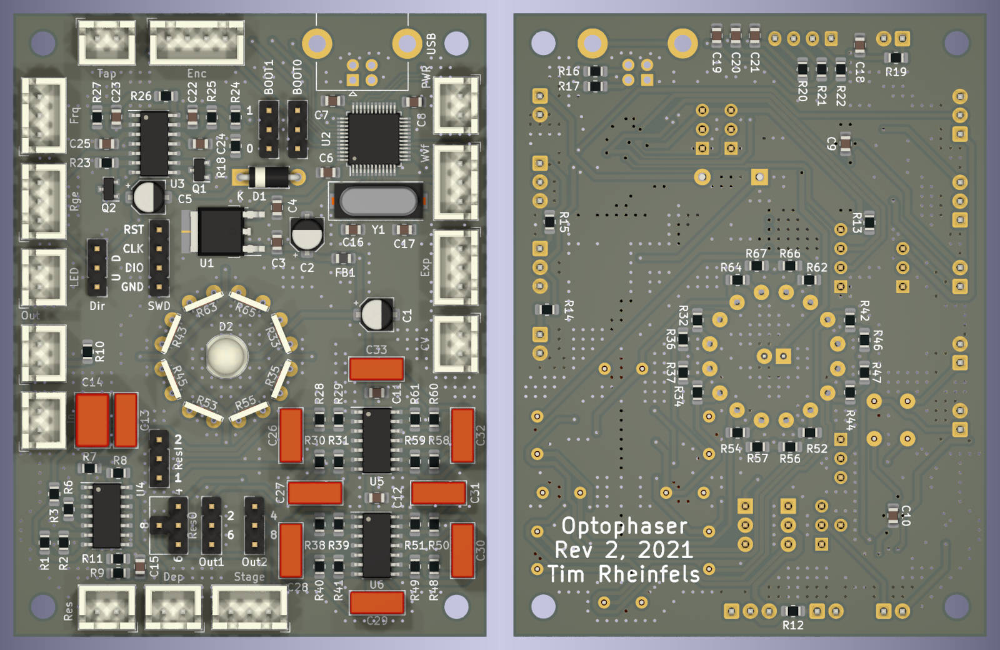

# Optophaser Guitar Pedal

This repository contains the ECAD files for a four stage optophaser guitar effect pedal designed in KiCad.

# Features

The phaser is based around well-known analog circuitry. What sets it apart from commercially available units is the large number of controls, the configurability (there are multiple combinations of voices), and the digital synthesis of the LFO signal. Both are detailed in the following sections.

## Controls

Beside a switch which allows for selecting the number of phaser stages and a tap tempo button, the controls comprise five potentiometers:

- Waveform: Blends between different LFO wave forms
- Frequency: LFO frequency
- Range: LFO amplitude (i.e., the frequency range the phaser spans)
- Depth: Gain for the mix (i.e., the amount of phasing effect)
- Resonance: Feedback gain (makes the phaser sound more *nasty*)

## Configurability

While not intended to be exposed to the case, there are multiple configuration options which can be selected via jumpers:

- Dir: Direction in which the LFO modulates the comb filter frequencies
- Out1: First tap of the phaser stage switch. Uses either the signal after the second or the sixth phasing stage
- Out2: Second tap of the phaser stage switch. Uses either the signal after the fourth or the eigth phasing stage
- ResO: Selects the origin of the resonance feedback signal. Either after the fourth, sixth, or eigth stage
- ResI: Selects the destination of the resonance feedback signal. Insert it either into the first or second phasing stage

## MCU-based LFO

Instead of an analog circuitry, this phaser unit uses an STM32 microcontroller for generating low-frequency oscillator signal which modulates the comb filter frequencies. This allows for implementing unusual features such as

- Generating arbitrary waveforms and blending them on the fly
- Tap tempo
- Expression pedal input (either resistive or via control voltage)

For the sake of usability, the MCU can be connected via USB. This allows for firmware updates and can potentially be used to upload arbitrary waveforms to the phaser.

## License

The ECAD files are licensed under CC-BY-SA, see [COPYING](COPYING).
